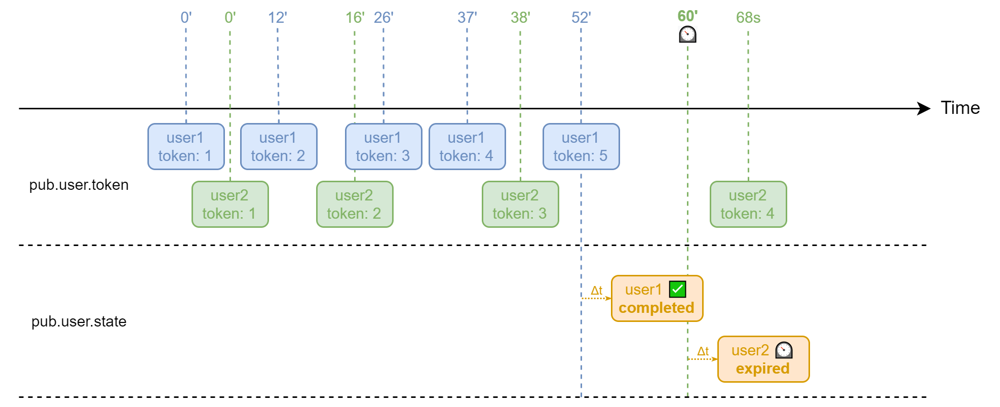

[](https://github.com/rogervinas/spring-cloud-stream-kafka-streams-processor/actions/workflows/gradle.yml)


# Spring Cloud Stream & Kafka Streams Binder + Processor API

[Spring Cloud Stream](https://spring.io/projects/spring-cloud-stream) is the solution provided by **Spring** to build applications connected to shared messaging systems.

It offers an abstraction (the **binding**) that works the same whatever underneath implementation we use (the **binder**):
* **Apache Kafka**
* **Rabbit MQ**
* **Kafka Streams**
* **Amazon Kinesis**
* ...

You can also check out [Spring Cloud Stream Kafka Streams first steps](https://github.com/rogervinas/spring-cloud-stream-kafka-streams-first-steps) where I got working a simple example using **Kafka Streams binder**.

In this one the goal is to use the **Kafka Streams binder** and the [Kafka Streams Processor API](https://kafka.apache.org/documentation/streams/developer-guide/processor-api.html) to implement the following scenario:



1. We receive messages with key = **userId** and value = { userId: string, token: number } from topic **pub.user.token**

2. For every **userId** which we receive **token** 1, 2, 3, 4 and 5 within under **1 minute**, we send a **completed** event to topic **pub.user.state**

3. For every **userId** which we receive at least one **token** but not the complete 1, 2, 3, 4 and 5 sequence within under **1 minute**, we send an **expired** event to topic **pub.user.state**

Ready? Let's code! 🤓

* [Test-first using kafka-streams-test-utils](#test-first-using-kafka-streams-test-utils)
* [UserStateStream implementation](#userstatestream-implementation)
  * [1. Aggregation by userId](#1-aggregation-by-userid)
  * [2. Completed UserStateEvents](#2-completed-userstateevents)
  * [3. UserStateProcessor implementation](#3-userstateprocessor-implementation)
  * [4. UserStateStream and UserStateProcessor integration](#4-userstatestream-and-userstateprocessor-integration)
* [Kafka Streams binder configuration](#kafka-streams-binder-configuration)
* [UserStateStream bean](#userstatestream-bean)
* [Integration Test](#integration-test)
  * [1. Kafka helpers](#1-kafka-helpers)
  * [2. DockerCompose Testcontainer](#2-dockercompose-testcontainer)
  * [3. Tests](#3-tests)
* [Important information about caching in the state stores](#important-information-about-caching-in-the-state-stores)
* [Test this demo](#test-this-demo)
* [Run this demo](#run-this-demo)
* See also
  * :octocat: [Spring Cloud Stream Kafka step by step](https://github.com/rogervinas/spring-cloud-stream-kafka-step-by-step)
  * :octocat: [Spring Cloud Stream & Kafka Confluent Avro Schema Registry](https://github.com/rogervinas/spring-cloud-stream-kafka-confluent-avro-schema-registry)
  * :octocat: [Spring Cloud Stream & Kafka Streams Binder first steps](https://github.com/rogervinas/spring-cloud-stream-kafka-streams-first-steps)
  * :octocat: [Spring Cloud Stream Multibinder](https://github.com/rogervinas/spring-cloud-stream-multibinder)

You can browse older versions of this repo:
* [Spring Boot 2.x](https://github.com/rogervinas/spring-cloud-stream-kafka-streams-processor/tree/spring-boot-2.x)

## Test-first using kafka-streams-test-utils

Once [kafka-streams-test-utils](https://kafka.apache.org/documentation/streams/developer-guide/testing.html) is properly setup in our [@BeforeEach](src/test/kotlin/com/rogervinas/kafkastreams/stream/UserStreamTest.kt#L39) we can implement this test:

```kotlin
data class UserTokenEvent(val userId: String, val token: Int)

enum class UserStateEventType { COMPLETED, EXPIRED }
data class UserStateEvent(val userId: String, val state: UserStateEventType)

@Test
fun `should publish completed event for one user`() {
  topicIn.pipeInput(USERNAME_1, UserTokenEvent(USERNAME_1, 1))
  topicIn.pipeInput(USERNAME_1, UserTokenEvent(USERNAME_1, 2))
  topicIn.pipeInput(USERNAME_1, UserTokenEvent(USERNAME_1, 3))
  topicIn.pipeInput(USERNAME_1, UserTokenEvent(USERNAME_1, 4))
  topicIn.pipeInput(USERNAME_1, UserTokenEvent(USERNAME_1, 5))

  topologyTestDriver.advanceWallClockTime(EXPIRATION.minusMillis(10))

  assertThat(topicOut.readKeyValuesToList()).singleElement().satisfies(Consumer { topicOutMessage ->
    assertThat(topicOutMessage.key).isEqualTo(USERNAME_1)
    assertThat(topicOutMessage.value).isEqualTo(UserStateEvent(USERNAME_1, COMPLETED))
  })
}

@Test
fun `should publish expired event for one user`() {
  topicIn.pipeInput(USERNAME_1, UserTokenEvent(USERNAME_1, 1))
  topicIn.pipeInput(USERNAME_1, UserTokenEvent(USERNAME_1, 2))

  topologyTestDriver.advanceWallClockTime(EXPIRATION.plus(SCHEDULE).plus(SCHEDULE))

  assertThat(topicOut.readKeyValuesToList()).singleElement().satisfies(Consumer { topicOutMessage ->
    assertThat(topicOutMessage.key).isEqualTo(USERNAME_1)
    assertThat(topicOutMessage.value).isEqualTo(UserStateEvent(USERNAME_1, EXPIRED))
  })
}
```

## UserStateStream implementation

We start first with our **UserStateStream** implementation as a **Function**:
* Which input is a **KStream<String, UserTokenEvent>**, as we want a **String** as the Kafka message's key and a **UserTokenEvent** as the Kafka message's value
* Which output is a **KStream<String, UserStateEvent>**, same here, **String** as the key and **UserStateEvent** as the value

```kotlin
class UserStateStream(
  private val schedule: Duration,
  private val expiration: Duration
) : Function<KStream<String, UserTokenEvent>, KStream<String, UserStateEvent>> {

  override fun apply(input: KStream<String, UserTokenEvent>): KStream<String, UserStateEvent> {
    TODO()
  }
}
```

Now step by step ...

### 1. Aggregation by userId

```kotlin
private const val USER_STATE_STORE = "user-state"

data class UserState(val userId: String = "", val tokens: List<Int> = emptyList()) {
  operator fun plus(event: UserTokenEvent) = UserState(event.userId, tokens + event.token)
}

class UserStateStream(
  private val schedule: Duration,
  private val expiration: Duration
) : Function<KStream<String, UserTokenEvent>, KStream<String, UserStateEvent>> {
  override fun apply(input: KStream<String, UserTokenEvent>): KStream<String, UserStateEvent> {
    return input
      .selectKey { _, event -> event.userId } // just in case but the key should be userId already
      .groupByKey()
      .aggregate(
        { UserState() },
        { userId, event, state ->
          logger.info("Aggregate $userId ${state.tokens} + ${event.token}")
          state + event // we use the UserState's plus operator
        },
        Materialized.`as`<String, UserState, KeyValueStore<Bytes, ByteArray>>(USER_STATE_STORE)
          .withKeySerde(Serdes.StringSerde())
          .withValueSerde(JsonSerde(UserState::class.java))
      )
      .toStream()
      // From here down it is just to avoid compilation errors
      .mapValues { userId, _ ->
        UserStateEvent(userId, COMPLETED) 
      }
  }
}
```

### 2. Completed UserStateEvents

We can generate **completed** **UserStateEvents** straightaway once we receive the last **UserTokenEvent**:

```kotlin
data class UserState(val userId: String = "", val tokens: List<Int> = emptyList()) {
  // ...
  val completed = tokens.containsAll(listOf(1, 2, 3, 4, 5))
}

class UserStateStream(
  private val schedule: Duration,
  private val expiration: Duration
) : Function<KStream<String, UserTokenEvent>, KStream<String, UserStateEvent>> {
  override fun apply(input: KStream<String, UserTokenEvent>): KStream<String, UserStateEvent> {
    return input
      // ...
      .toStream()
      .mapValues { state ->
        logger.info("State $state")
        when {
          state.completed -> UserStateEvent(state.userId, COMPLETED)
          else -> null
        }
      }
      .filter { _, event -> event != null }
      .mapValues { event ->
        logger.info("Publish $event")
        event!!
      }
  }
}
```

### 3. UserStateProcessor implementation

Our **UserStateProcessor** will scan periodically the **"user-state"** store and it will apply our expiration logic to every **UserState**:

```kotlin
class UserStateProcessor(
  private val schedule: Duration,
  private val expiration: Duration
) : Processor<String, UserState, Void, Void> {

  override fun init(context: ProcessorContext<Void, Void>) {
    context.schedule(schedule, PunctuationType.WALL_CLOCK_TIME) { time ->
      val stateStore = context.getStateStore<KeyValueStore<String, ValueAndTimestamp<UserState>>>(USER_STATE_STORE)
      stateStore.all().forEachRemaining { it : KeyValue<String, ValueAndTimestamp<UserState>> ->
        logger.info("Do something with $it!!") // TODO
      }
    }
  }

  override fun process(record: Record<String, UserState>?) {
    // we do not need to do anything here
  }
}
```

Just apply the expiration logic this way:

```kotlin
data class UserState(val userId: String = "", val tokens: List<Int> = emptyList(), val expired: Boolean = false) {
  // ...
  fun expire() = UserState(userId, tokens, true)
}

class UserStateProcessor(
  private val schedule: Duration,
  private val expiration: Duration
) : Processor<String, UserState, Void, Void> {

  override fun init(context: ProcessorContext<Void, Void>) {
    context.schedule(schedule, PunctuationType.WALL_CLOCK_TIME) { time ->
      val stateStore = context.getStateStore<KeyValueStore<String, ValueAndTimestamp<UserState>>>(USER_STATE_STORE)
      stateStore.all().forEachRemaining {
        val age = Duration.ofMillis(time - it.value.timestamp())
        if (age > expiration) {
          if (it.value.value().expired) {
            // if it is already expired from a previous execution, we delete it
            logger.info("Delete ${it.key}")
            stateStore.delete(it.key)
          } else {
            // if it has expired right now, we mark it as expired and we update it
            logger.info("Expire ${it.key}")
            stateStore.put(it.key, ValueAndTimestamp.make(it.value.value().expire(), it.value.timestamp()))
          }
        }
      }
    }
  }
}
```

### 4. UserStateStream and UserStateProcessor integration

```kotlin
class UserStateStream(
  private val schedule: Duration,
  private val expiration: Duration
) : Function<KStream<String, UserTokenEvent>, KStream<String, UserStateEvent>> {
  override fun apply(input: KStream<String, UserTokenEvent>): KStream<String, UserStateEvent> {
    return input
      // ...
      .toStream()
      // we add the UserStateProcessor
      .apply { process(ProcessorSupplier { UserStateProcessor(schedule, expiration) }, USER_STATE_STORE) }
      // downstream we will both receive upstream realtime values as the ones "generated" by the UserStateProcessor
      .mapValues { state ->
        logger.info("State $state")
        when {
          // null states are sent downstream by UserStateProcessor when deleting entries from the store
          state == null -> null // "null" value generated by UserStateProcessor deleting values from the store
          // completed states are sent downstream from upstream
          state.completed -> UserStateEvent(state.userId, COMPLETED)
          // expired states are sent downstream by UserStateProcessor when updating entries from the store
          state.expired -> UserStateEvent(state.userId, EXPIRED)
          else -> null
        }
      }
      .filter { _, event -> event != null }
      .mapValues { event ->
        logger.info("Publish $event")
        event!!
      }
  }
}
```

And just at this point our [UserStreamTest](src/test/kotlin/com/rogervinas/kafkastreams/stream/UserStreamTest.kt) should pass 🟩 👌

## Kafka Streams binder configuration

Easy!

```yaml
spring:
  application:
    name: "spring-cloud-stream-kafka-streams-processor"
  cloud:
    stream:
      function:
        definition: userStateStream
        bindings:
          userStateStream-in-0: "pub.user.token"
          userStateStream-out-0: "pub.user.state"
      kafka:
        streams:
          binder:
            applicationId: "${spring.application.name}"
            brokers: "localhost:9094"
            configuration:
              default:
                key.serde: org.apache.kafka.common.serialization.Serdes$StringSerde
                value.serde: org.apache.kafka.common.serialization.Serdes$StringSerde
```

With this configuration:
* **Spring Cloud Stream** will create a **Kafka Streams binder** connected to **localhost:9094**
* We need to create a **@Bean** named **userStateStream** that should implement **Function<KStream, KStream>** interface
    * This **@Bean** will connect a **KStream** subscribed to **pub.user.token** topic to another **KStream** publishing to **pub.user.state** topic

You can find all the available configuration properties documented in [Kafka Streams Properties](https://cloud.spring.io/spring-cloud-stream-binder-kafka/spring-cloud-stream-binder-kafka.html#_kafka_streams_properties).

## UserStateStream bean

As required by our configuration we need to create a @Bean named `userStateStream`:

```kotlin
@Configuration
class ApplicationConfiguration {

  @Bean
  fun userStateStream(
    @Value("\${user.schedule}") schedule: Duration,
    @Value("\${user.expiration}") expiration: Duration
  ): Function<KStream<String, UserTokenEvent>, KStream<String, UserStateEvent>> = UserStateStream(schedule, expiration)
}
```

## Integration Test

We already "unit test" our **UserStateStream** with **kafka-streams-test-utils** but we need also an integration test using a Kafka container ... [Testcontainers](https://www.testcontainers.org) to the rescue!

### 1. Kafka helpers

First we need utility classes to produce to Kafka and consume from Kafka using **kafka-clients** library:

```kotlin

class KafkaConsumerHelper(bootstrapServers: String, topic: String) {
  
  fun consumeAll(): List<ConsumerRecord<String, String>> {
    // ...
  }

  fun consumeAtLeast(numberOfRecords: Int, timeout: Duration): List<ConsumerRecord<String, String>> {
    // ...
  }
}

class KafkaProducerHelper(bootstrapServers: String) {
  
  fun send(topic: String?, key: String, body: String) {
    // ...
  }
}
```

### 2. DockerCompose Testcontainer

As described in [Testcontainers + Junit5](https://www.testcontainers.org/test_framework_integration/junit_5/) we can use `@Testcontainers` annotation:

```kotlin
@SpringBootTest
@Testcontainers
@ActiveProfiles("test")
class ApplicationIntegrationTest {

  companion object {

    @Container
    val container = DockerComposeContainerHelper().createContainer()
  }
  
  // ...
}
```

### 3. Tests

And finally the tests, using [Awaitility](https://github.com/awaitility/awaitility) as we are testing asynchronous stuff:

```kotlin
class ApplicationIntegrationTest {
  
  // ...

  @Test
  fun `should publish completed event`() {
    val username = UUID.randomUUID().toString()

    kafkaProducerHelper.send(TOPIC_USER_TOKEN, username, """{"userId": "$username", "token": 1}""")
    kafkaProducerHelper.send(TOPIC_USER_TOKEN, username, """{"userId": "$username", "token": 2}""")
    kafkaProducerHelper.send(TOPIC_USER_TOKEN, username, """{"userId": "$username", "token": 3}""")
    kafkaProducerHelper.send(TOPIC_USER_TOKEN, username, """{"userId": "$username", "token": 4}""")
    kafkaProducerHelper.send(TOPIC_USER_TOKEN, username, """{"userId": "$username", "token": 5}""")

    await().atMost(ONE_MINUTE).untilAsserted {
      val record = kafkaConsumerHelper.consumeAtLeast(1, ONE_SECOND)
      assertThat(record).singleElement().satisfies(Consumer {
        assertThat(it.key()).isEqualTo(username)
        JSONAssert.assertEquals("""{"userId": "$username", "state": "COMPLETED"}""", it.value(), true)
      })
    }
  }

  @Test
  fun `should publish expired event`() {
    val username = UUID.randomUUID().toString()

    kafkaProducerHelper.send(TOPIC_USER_TOKEN, username, """{"userId": "$username", "token": 1}""")
    kafkaProducerHelper.send(TOPIC_USER_TOKEN, username, """{"userId": "$username", "token": 2}""")
    kafkaProducerHelper.send(TOPIC_USER_TOKEN, username, """{"userId": "$username", "token": 3}""")
    kafkaProducerHelper.send(TOPIC_USER_TOKEN, username, """{"userId": "$username", "token": 4}""")

    await().atMost(ONE_MINUTE).untilAsserted {
      val record = kafkaConsumerHelper.consumeAtLeast(1, ONE_SECOND)
      assertThat(record).singleElement().satisfies(Consumer {
        assertThat(it.key()).isEqualTo(username)
        JSONAssert.assertEquals("""{"userId": "$username", "state": "EXPIRED"}""", it.value(), true)
      })
    }
  }
}
```

And just at this point all our tests should pass 🟩 👏

That's it, happy coding! 💙

## Important information about caching in the state stores

If you [run this demo](#run-this-demo) you will notice that the **completed** **UserStateEvents** are not sent inmediately:
```
12:36:34.593 : Aggregate 1 [] + 1
12:36:36.110 : Aggregate 1 [1] + 2
12:36:37.660 : Aggregate 1 [1, 2] + 3
12:36:38.061 : Aggregate 1 [1, 2, 3] + 4
12:36:48.890 : Aggregate 1 [1, 2, 3, 4] + 5
12:36:58.256 : State UserState(userId=1, tokens=[1, 2, 3, 4, 5], expired=false)
12:36:58.262 : Publish UserStateEvent(userId=1, state=COMPLETED)
```

In this example ☝️ the **UserStateEvent** is sent 10 seconds after the last **UserTokenEvent** is received. 

Why? The answer is: **caching**!

As stated in [Kafka Streams > Developer Guide > Memory Management](https://kafka.apache.org/documentation/streams/developer-guide/memory-mgmt):
> The semantics of caching is that data is flushed to the state store and forwarded to the next downstream processor node whenever the earliest of commit.interval.ms or cache.max.bytes.buffering (cache pressure) hits.

And also in [A Guide to Kafka Streams and Its Uses](https://www.confluent.io/blog/how-kafka-streams-works-guide-to-stream-processing/#ktable):
> KTable objects are backed by state stores, which enable you to look up and track these latest values by key. Updates are likely buffered into a cache, which gets flushed by default every 30 seconds.

## Test this demo

```shell
./gradlew test
```

## Run this demo

Run with docker-compose:
```shell
docker-compose up -d
./gradlew bootRun
docker-compose down
```

Then you can use [kcat](https://github.com/edenhill/kcat) to produce/consume to/from **Kafka**:
```shell
# consume
kcat -b localhost:9094 -C -t pub.user.token -f '%k %s\n'
kcat -b localhost:9094 -C -t pub.user.state -f '%k %s\n'

# produce
echo '1:{"userId":"1", "token":1}' | kcat -b localhost:9094 -P -t pub.user.token -K:
echo '1:{"userId":"1", "token":2}' | kcat -b localhost:9094 -P -t pub.user.token -K:
echo '1:{"userId":"1", "token":3}' | kcat -b localhost:9094 -P -t pub.user.token -K:
echo '1:{"userId":"1", "token":4}' | kcat -b localhost:9094 -P -t pub.user.token -K:
echo '1:{"userId":"1", "token":5}' | kcat -b localhost:9094 -P -t pub.user.token -K:
```
